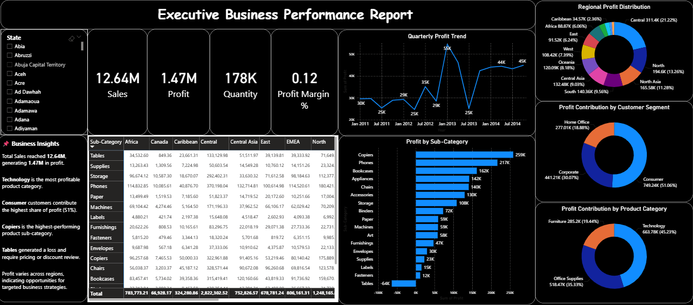
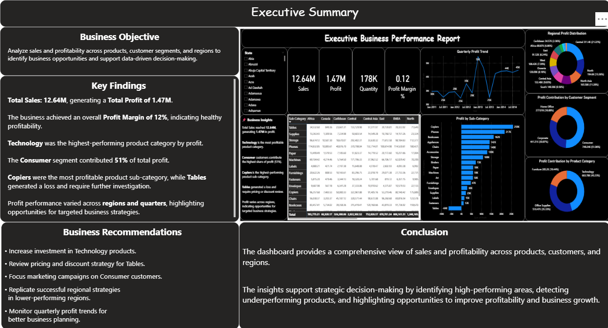

# Sample Superstore Dashboard

Task 2: Data Visualization and Storytelling –Sample Superstore Dashboard

## Project Overview

This project was completed as part of the **Data Analyst Internship – Task 2: Data Visualization and Storytelling**.

The objective was to design an interactive Power BI dashboard that transforms raw sales data into meaningful business insights through effective data visualization and storytelling. The dashboard enables stakeholders to monitor business performance, identify profitable products and customer segments, evaluate regional performance, and support data-driven decision-making.

---

## Business Objective

Analyze sales, profitability, customer segments, product categories, and regional performance to identify business opportunities, improve profitability, and support strategic decision-making.

---

## Tools Used

- Microsoft Power BI
- Microsoft Excel
- Power Query
- DAX (Data Analysis Expressions)

---

## Dataset Information

- **Dataset:** Sample Superstore
- **Domain:** Retail Sales and Business Analytics

### Main Fields

- Sales
- Profit
- Quantity
- Order Date
- Category
- Sub-Category
- Customer Segment
- Region
- State

---

## Dashboard Features

- Interactive filters for country, state, and region
- KPI Cards for:
  - Total Sales
  - Total Profit
  - Total Quantity
  - Profit Margin
- Quarterly Profit Trend Analysis
- Regional Profit Distribution
- Customer Segment Profit Analysis
- Product Category Profit Analysis
- Product Sub-Category Profit Ranking
- Regional Performance Matrix
- Executive Summary Page with business insights and recommendations

---

## Key Insights

- **Total Sales:** 12.64M
- **Total Profit:** 1.47M
- **Profit Margin:** 12%
- Technology generated the highest overall profit.
- The Consumer segment contributed approximately 51% of total profit.
- Copiers were the most profitable product sub-category.
- Tables generated negative profit, indicating potential pricing or discount issues.
- Profit performance varied across regions and quarters, highlighting opportunities for strategic planning.

---

## Business Recommendations

- Increase investment in Technology products due to their high profitability.
- Review pricing and discount strategies for Tables to reduce losses.
- Focus marketing efforts on the Consumer customer segment.
- Replicate successful sales strategies from high-performing regions.
- Monitor quarterly profit trends to improve forecasting and planning.

---

## Skills Demonstrated

- Data Visualization
- Data Storytelling
- Business Intelligence
- Dashboard Design
- KPI Development
- Sales Performance Analysis
- Profitability Analysis
- Customer Segment Analysis
- Product Performance Analysis
- Regional Performance Analysis
- Power Query
- DAX Calculations
- Business Reporting

---

## Files Included

```
Task2_DataVisualization/
│
├── Sample_Superstore.pbix
├── Sample_Superstore.csv
├── Dashboard_Page1.png
├── Executive_Summary_Page2.png
└── README.md
```

---

## Dashboard Preview

### Page 1 – Executive Business Dashboard




### Page 2 – Executive Summary



---

## Conclusion

This project demonstrates the ability to transform retail sales data into an interactive business intelligence dashboard that communicates actionable insights through effective visualization and storytelling. The report supports strategic decision-making by identifying profitable products, customer segments, and regional trends while highlighting areas requiring business improvement.

---

## Author

**Lidiya Mitiku**

- **LinkedIn:** https://www.linkedin.com/in/lidiya-mitiku-10b816189/
- **GitHub:** https://github.com/Lidiya2324
